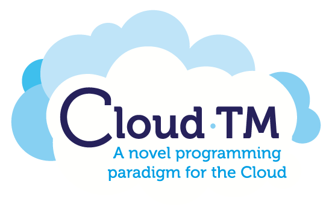

#Cloud-TM Infinispan Actuator

This GitHub repository contains the source code of the Infinispan Actuator and it is associated with the project <a href="http://www.cloudtm.eu">Cloud-TM project</a>.

The Infinispan Actuator main goal is to provide a commom module to trigger the self-tunning mechanism provided by an Infinispan server.

Currently, this features are supporter

* Add or remove JMX instances
* Add new JMX protocols implementation (JMX-RMI and Remoting-JMX are automatically registered)
* Trigger Auto-Placer, Replication Degree Optimizer, Replication Protocol Optimizer
* Generic invocation in any method exporter by JMX interface in three different modes:
    * In one specific instance
    * In any instance
    * In all instances

This work was generated in the framework of the Specific Targeted Research Project (STReP) Cloud-TM, which is co-financed by the European Commission through the contract no. 257784.

 

Copyright
============
The Cloud-TM Project is Copyright © 2010-2013 Cloud-TM Consortium. It is free software, and may be redistributed under the terms specified in the LICENSING.txt file.
